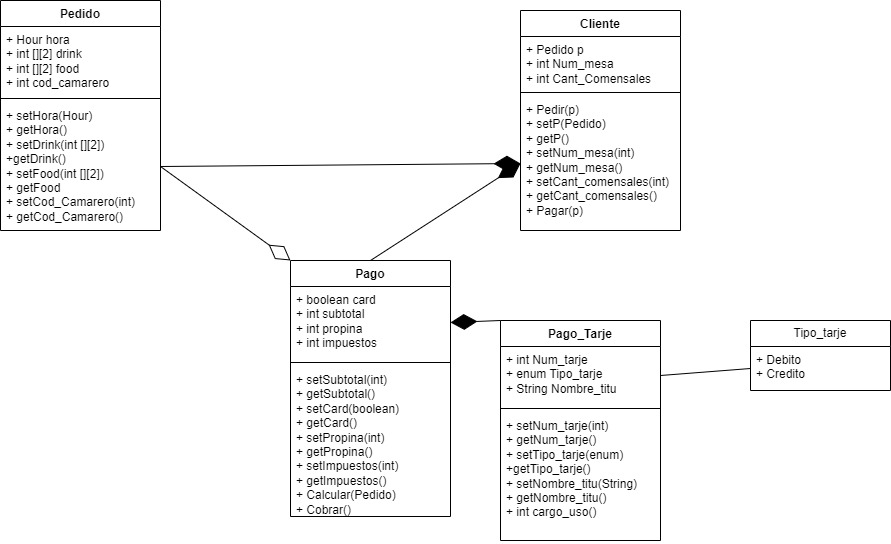

# ExamenDePruebaUML
En esta prueba del exámen he decidido tomar como foco central el cliente, que es quien realiza las acciones de pago y pedido, a parte, para determinar que ha pedido para que luego se pueda pagar, he decidido que la comida y la bebida sean arrays bidimensionales de ints, donde el priumero sería el código del producto y el segundo la cantidad.

